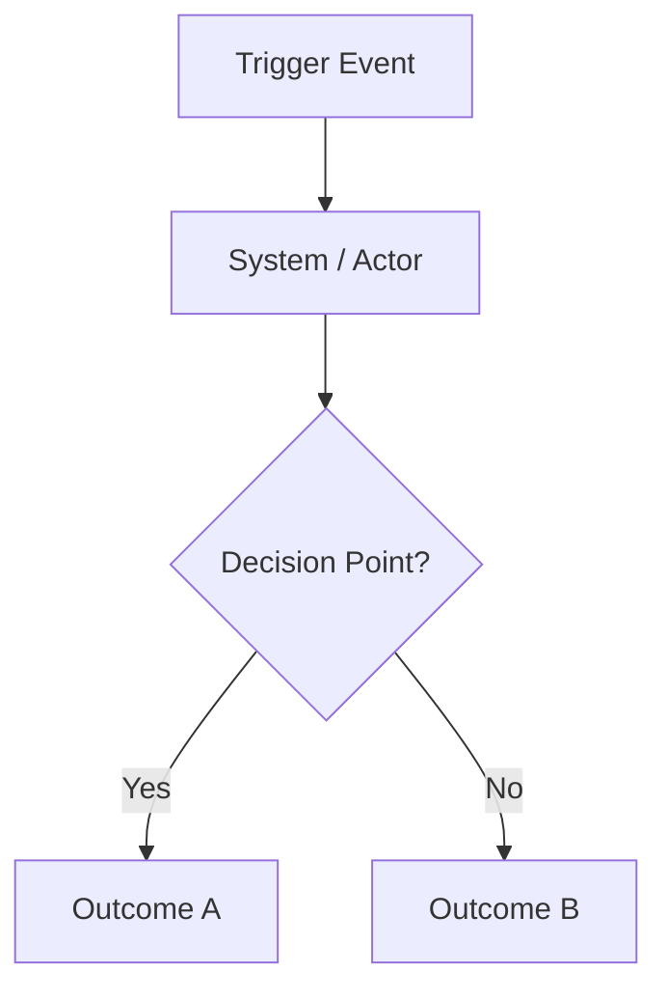

# Feature Request Refinement Skill

## Purpose
Convert ill-formed, surface-level requests into well-formed, actionable briefs that downstream teams (product, design, engineering) can build from — without losing the original request context or overwriting prior decisions.

This skill is **investigative and additive**. Each stage appends to the document. Nothing is removed or changed after it has been locked.

---

## Commands

| Command | Use When |
|---------|----------|
| `/frr-partner [Team, Person]` | Request originates from a partner team building on the platform |
| `/frr-customer [Agency, Person]` | Request originates from an agency / end customer |
| `/frr-self` | Vlad is originating the request himself |

### Invocation Examples
```
/frr-partner [Avigilon, Todd Piatt] support correlation service linking CAD incidents to VESTA 911 call IDs for reporting consolidation
/frr-customer [Nashville PD, John Smith] when unit is dispatched, helicopter ETA should show on map
/frr-self correlation service to link CAD incidents across cloud API and on-prem push paths to VESTA call IDs for partner reporting
```

---

## Behavior by Command Mode

### `/frr-partner`
- Requestor is a partner team — they are building on top of the platform
- Validate: did they confirm this with an actual agency, or is this their own interpretation?
- Push-back posture: **high** — can redirect approach, flag if solving at wrong layer
- Gap hints: technical, API, data model, integration-layer focused
- Stakes framing: integration/product gap
- Escalation path: Partner PM, integration team, agency contact if needed
- Missing problem statement: ⛔ hard block — return challenge before proceeding

### `/frr-customer`
- Requestor is an agency — they dispatch real incidents
- Validate: is this one agency's need or broadly applicable?
- Push-back posture: **low** — solve their operational problem
- Gap hints: dispatcher workflow, cognitive load, field officer perspective
- Stakes framing: operational / potentially life-safety
- Escalation path: Agency contact, CS, account team
- Missing problem statement: ⛔ hard block — return challenge before proceeding

### `/frr-self`
- Vlad is originating — problem context is already known
- Skip requestor validation
- Focus on making the brief complete enough to hand off
- Gap hints: both technical and operational as appropriate
- Stakes framing: depends on initiative
- Missing problem statement: ⚠️ soft flag — prompt to articulate for handoff clarity

---

## Hard Block — Missing Problem Statement

If no problem statement or reason for the request is provided, **do not proceed with refinement**. Return this challenge prominently at the top of the output:

> ⛔ **No problem statement provided.**
> This request cannot be refined until the underlying problem is articulated.
> - What operational pain, gap, or failure does this solve?
> - Who is affected and how often?
> - What happens today without this capability?
>
> Provide answers to the above before refinement can continue.

This applies to `/frr-partner` and `/frr-customer`. For `/frr-self` this is a soft warning, not a hard block.

---

## Cognitive Process

### Step 1 — Capture the Raw Request
Preserve verbatim. Never modify.

### Step 2 — Identify Known vs Unknown
- **Explicit** — clearly stated
- **Implicit** — assumed but not stated
- **Missing** — needed but not provided

### Step 3 — Map the Underlying Problem
Ask: *What is the requestor actually trying to solve?*

Examples:
- "Give us serial numbers of radio devices" → Actually: sync radio audio to body cam footage at upload via device confirmation push
- "Support riding position" → Actually: track personnel-to-vehicle assignment for fire accountability across multi-officer rotations over 12-month cycles
- "Show helicopter ETA on map" → Actually: ingest periodic helicopter location updates, render ETA with defined cadence and staleness handling

### Step 4 — Validate or Construct the End-to-End Flow
Map from trigger event through all system touch points to end outcome.

For each system note:
- ✅ **Confirmed** — explicitly named, role is clear
- ⚠️ **Assumed** — inferred, needs validation
- ❓ **Missing** — required but not mentioned

If requestor provided an explicit systems list, use it as starting point and validate against actual flow. Flag gaps.

Produce a Mermaid diagram if flow has more than 3 steps. Preserve any visual materials provided as input.

### Step 5 — Define Success Criteria
Measurable, dispatcher/field-perspective outcomes. Specific enough to inform acceptance testing.

### Step 6 — Surface Trade-offs
Identify competing priorities. Flag which have stated preferences and which are open.

### Step 7 — Assess Urgency
If urgency is claimed, capture justification (compliance deadline, customer commitment, operational impact). If not provided: **flag as gap** with suggested default.

### Step 8 — Capture Timeline and Stakeholder Context
- Timeline: hard deadline, target quarter, or aspirational
- Requesting party: team and person
- Date submitted
- Who validated the underlying problem
- Known downstream stakeholders

---

## Gap Hint Behavior

When a field is missing, do not just flag it — suggest a likely answer based on context so the requestor confirms or corrects rather than starts from scratch.

Format:
> ⚠️ **[Field] not specified.**
> Suggested: [reasonable default based on context]
> Confirm or override.

Examples:
> ⚠️ **Update cadence not specified.**
> Suggested: 30-second intervals based on typical AVL patterns.
> Confirm or override.

> ⚠️ **Urgency justification not provided.**
> Suggested: Partner reporting milestone dependency — confirm if this is blocking a delivery commitment.
> Confirm or override.

---

## Output Delivery

After generating the brief, always save it as a `.md` file to:
```
~/Documents/Claude_code/briefs/
```

Filename format: `YYYY-MM-DD-[slug].md`
where slug is a 3-5 word kebab-case summary of the request topic.

Example: `2026-03-08-correlation-service-cad-vesta.md`

Also render the brief inline in the conversation.

---

## Output Structure

The output is a **living brief**. Sections are append-only. Prior sections are never edited after locked. Output format is `.md`.

---

### SECTION 1 — Raw Request
> Preserved verbatim. Never modified.

**Requestor:** [Team, Person]
**Date Submitted:** [Date or ⚠️ Not provided]
**Mode:** Partner / Customer / Self

---

### SECTION 2 — Refinement

**Underlying Problem**
[What is actually being solved — or ⛔ BLOCKED if not provided]

**End-to-End Flow**


**Affected Systems and Interfaces**
| System | Role in Flow | Status |
|--------|-------------|--------|
| System A | Description | ✅ Confirmed |
| System B | Description | ⚠️ Assumed |
| System C | Description | ❓ Missing |

**Success Criteria**
- [ ] Criterion 1 (measurable, dispatcher/field perspective)
- [ ] Criterion 2

**Trade-offs**
| Trade-off | Stated Preference | Status |
|-----------|------------------|--------|
| Trade-off A | Preference if known | ✅ Resolved / ❓ Open |

**Urgency Justification**
- Claimed: [Yes / No]
- Justification: [Stated or ⚠️ Suggested: ...]
- Impact if delayed: [Stated or ⚠️ Suggested: ...]

**Timeline**
- Hard deadline: [Date or ⚠️ Suggested: ...]
- Target: [Quarter or milestone]

**Stakeholder Context**
- Requesting party: [Team, Person]
- Date submitted: [Date]
- Problem validated by: [Name/role or ⚠️ Not yet validated]
- Downstream stakeholders: [List]

**Assumptions and Open Questions**
1. [Question or assumption with suggested answer where possible]
2. [Question or assumption with suggested answer where possible]

**Reference Materials**
- [Links or filenames of visual materials provided with request]

**Decisions — Refinement Stage**
| # | Decision | Rationale | Made By |
|---|----------|-----------|---------|

**Refinement Status:** ⚠️ Draft / ✅ Locked

---

### SECTION 3 — Product Brief
> Added after refinement is locked. Never modifies Section 2.

[Acceptance criteria, scenarios, edge cases, constraints]

**Decisions — Product Brief Stage**
| # | Decision | Rationale | Made By |
|---|----------|-----------|---------|

---

### SECTION 4 — Design Considerations
> Added after product brief is locked.

[UX constraints, dispatcher cognitive load, interaction patterns, display rules]

**Decisions — Design Stage**
| # | Decision | Rationale | Made By |
|---|----------|-----------|---------|

---

### DECISIONS LOG
> Chronological summary of all decisions across all stages.

| # | Stage | Decision | Rationale | Made By | Date |
|---|-------|----------|-----------|---------|------|

---

## Output Decision Tree

```
Received request
       │
       ▼
Problem statement present?
   NO  → ⛔ HARD BLOCK (partner/customer) or ⚠️ SOFT FLAG (self)
         Return challenge. Do not proceed.
   YES → continue
       │
       ▼
Can underlying problem be mapped to end-to-end flow?
   YES → continue
   NO  → FLAG: Flow incomplete. Document known steps, list missing systems.
         Provide gap hints with suggested answers.
       │
       ▼
Are success criteria definable?
   YES → LOCK Section 2. Proceed to Product Brief.
   NO  → FLAG: Cannot define done. Suggest likely criteria based on context.
```

---

## Examples

### Example 1 — `/frr-partner`
```
/frr-partner [Avigilon, Todd Piatt] support correlation service linking CAD incidents
created via cloud API or pushed to cloud from on-prem to VESTA 911 call IDs to allow
reporting capabilities that consolidate historically disjointed data
```
**Underlying problem:** Reporting systems cannot reconstruct the full incident lifecycle because there is no persistent correlation key linking CAD incident IDs to VESTA 911 Call IDs across creation paths.
**Key gaps flagged:** Is correlation 1:1 or 1:many? Real-time or async? Historical backfill strategy? Who owns the correlation service?

### Example 2 — `/frr-customer`
```
/frr-customer [Nashville PD, John Smith] when unit is dispatched, helicopter ETA
should show on map
```
**Underlying problem:** Dispatchers need real-time helicopter location and ETA on CAD map for air resource coordination during active incidents.
**Key gaps flagged:** Update cadence (suggested: 30s), data format from helicopter system, staleness threshold, failure mode if ETA goes stale.

### Example 3 — `/frr-self`
```
/frr-self riding position tracking for fire apparatus — officers need to be assigned
to vehicle positions (driver, passenger, rear) with persistence across shift rotations
```
**Underlying problem:** Fire apparatus carries multiple officers in designated positions. Assignment must persist for accountability and response capability tracking over 12-month cycles without adding login friction.
**Trade-off flagged:** Accuracy vs login friction — needs product decision.
